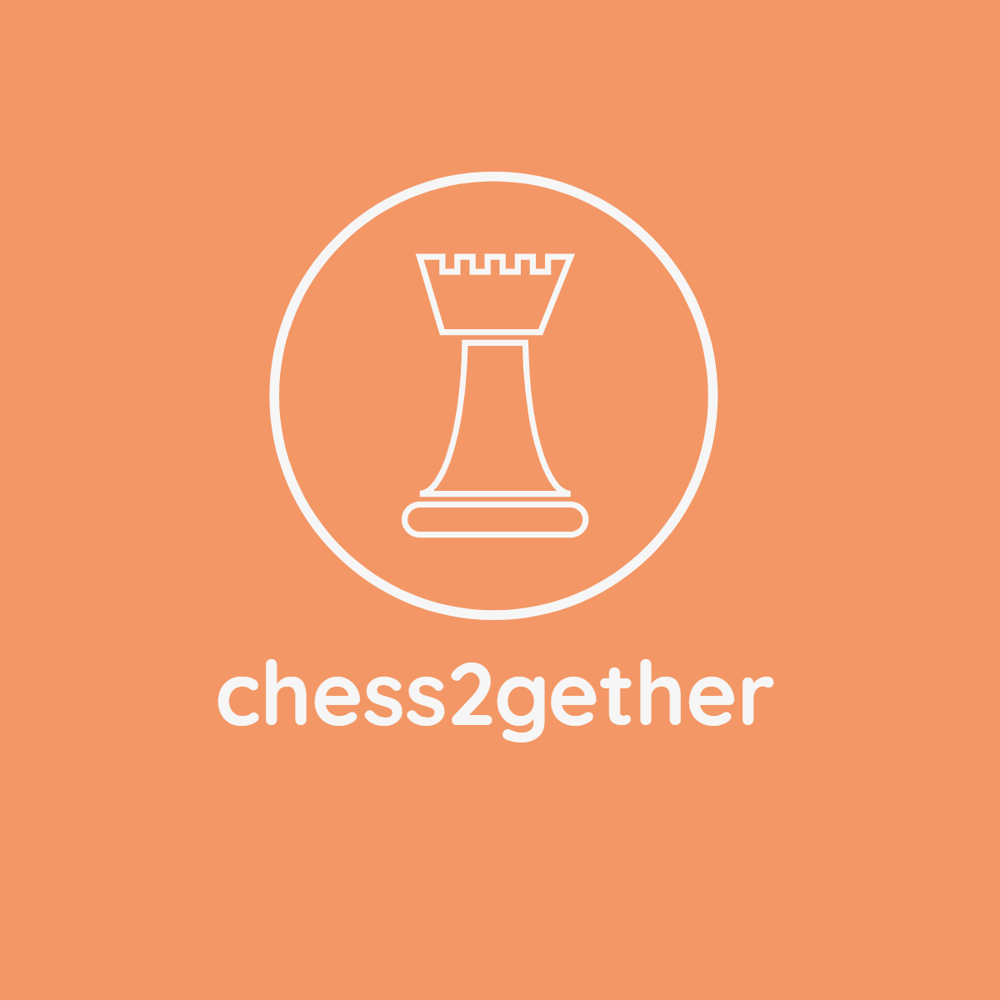
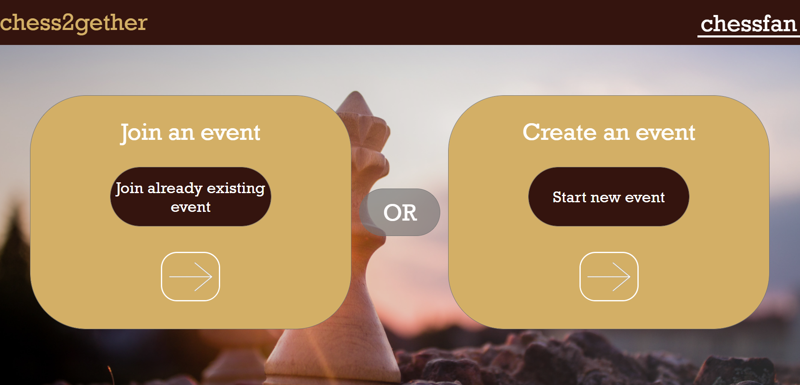

# chess2gether

Website which allows to organize or join existing chess event.

</br>


## Built with

- HTML
- CSS
- Javascript
- PHP 7.4
- Docker
- Mapbox


## Getting started
Requirements:
- [Docker](https://www.docker.com/)
- Any text editor (for example [vsCode](https://www.docker.com/))

Get started with a project:
- Clone the repository
```
git clone https://github.com/pmarek2k/chess2gether
```
- Change working directory to cloned repo:
```
cd chess2gether
```
- Build your application:
``` 
docker-compose build
```
- Add config.js file to public/js with following code:
``` 
export const accessToken = 'YOUR_ACCESS_TOKEN';
```
To get your Mapbox access token login to [Mapbox](https://www.mapbox.com/) and create one.
- Run your application:
```angular2html
docker-compose up
```
